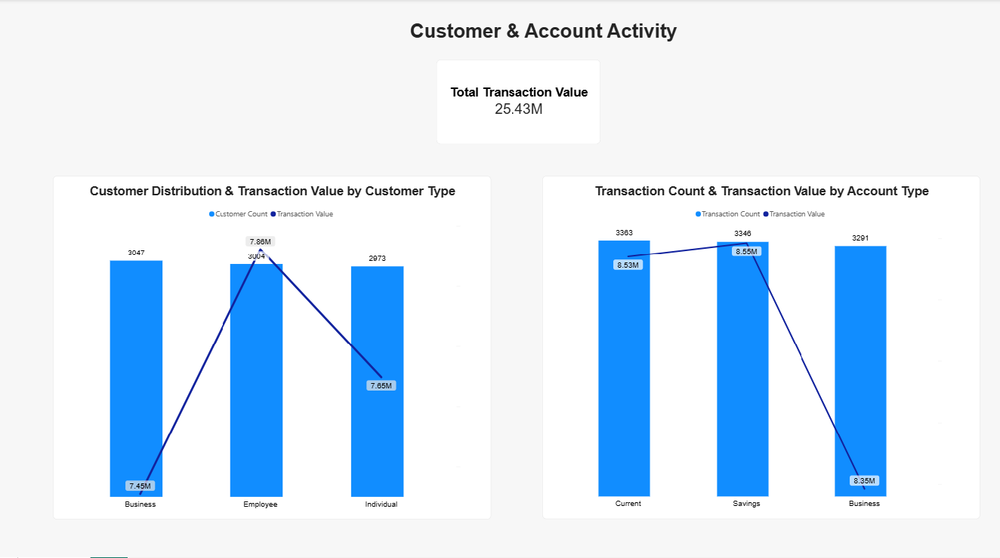
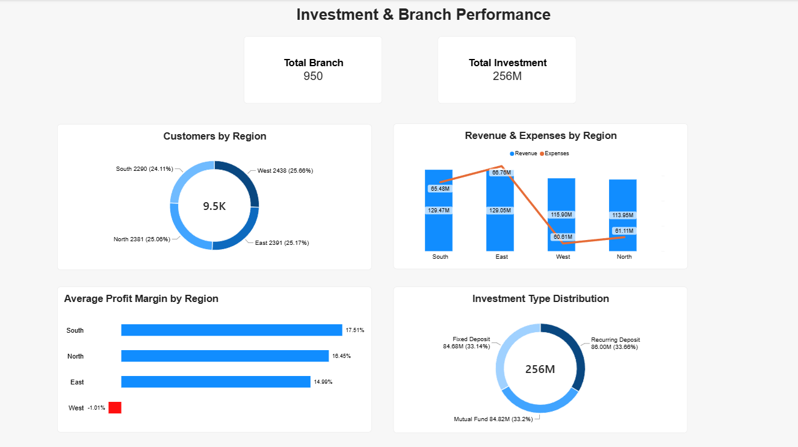

# Banking & Customer Transaction Analysis

## Project Overview

This project analyzes customer, transaction, investment, and branch financial data to identify patterns in customer activity, account usage, investment behavior, and regional branch performance.

The analysis was conducted using SQL for data cleaning, validation, transformation, and analysis, with Power BI used to create an interactive dashboard for business reporting.
## Business Problem

Management wants to understand:

- Who are the main customer segments?
- How do transaction patterns differ across account types?
- Which investment products generate the highest investment value?
- How does branch performance vary across regions?
- Which regions may require further investigation to improve profitability?
## Tools & Technologies

- **MySQL** — database management and data preparation
- **SQL** — data cleaning, validation, transformation, and analysis using JOINs, GROUP BY, CASE WHEN, CTEs, and window functions
- **Power BI** — interactive dashboard and data visualization
## Dataset

The dataset contains three related tables:

| Table | Rows | Description |
|---|---:|---|
| `customer_data` | 9,500 | Customer demographics and branch information |
| `transaction_data` | 10,000 | Customer transactions and investment activity |
| `bank_data` | 950 | Branch revenue, expenses, and profitability |

### Data Relationships

- `customer_data.Customer_ID` → `transaction_data.Customer_ID`
- `bank_data.Branch_ID` → `customer_data.Branch_ID`
## Data Cleaning & Validation

The data was profiled and validated before analysis.

- Replaced blank `Customer_Type` values with `Unknown` (476 records).
- Replaced blank `City` values with `Unknown` (471 records).
- Converted `Transaction_Amount` to `DECIMAL(10,2)` for consistent numeric precision.
- Added `Calculated_Profit_Margin` based on firm revenue and expenses.
- Checked for duplicate records; no full-row duplicates were found.
- Validated key relationships between the three tables.
- Identified 501 transaction records with unmatched `Customer_ID` values.
- Identified 491 customer records with unmatched `Branch_ID` values.
## SQL Analysis

The analysis focused on three main areas:

### Customer & Account Analysis
- Customer distribution by customer type and region
- Transaction count and transaction value by account type
- Transaction value by customer type

### Transaction & Investment Analysis
- Total and average investment by investment type
- Investment transaction volume by investment type

### Branch Performance
- Revenue and expenses by region
- Average profit margin by region
- Branch performance ranking using window functions
## Key Insights

- **Employee customers generated the highest transaction value** at RM7.86M, despite Business customers being the largest customer segment.
- **Savings accounts generated the highest transaction value** at RM8.55M and the highest average transaction amount among account types.
- **Recurring Deposits generated the highest total investment value** at RM86.00M, slightly ahead of Mutual Funds and Fixed Deposits.
- **South recorded the highest average profit margin** at 17.51%, while West recorded a negative average profit margin of -1.01%.
- **East had the highest total expenses** at RM66.76M, despite generating the second-highest regional revenue.
- **North achieved a higher average profit margin than East** despite having lower total revenue, showing that higher revenue does not necessarily translate into higher profitability.
## Recommendations

- **Target employee customers** with tailored account promotions and engagement campaigns, given their higher transaction value.
- **Promote Savings accounts** by identifying and communicating the factors that contribute to their higher transaction value and average transaction amount.
- **Increase awareness of Recurring Deposits** through targeted campaigns, given their leading total and average investment values.
- **Investigate West region branches** to identify factors contributing to the negative average profit margin and prioritize underperforming branches for operational improvement.
- **Review expense drivers in East** and identify opportunities to improve cost efficiency, as East recorded the highest total expenses.
## Power BI Dashboard
### Page 1 — Customer & Account Activity

### Page 2 — Investment & Branch Performance

